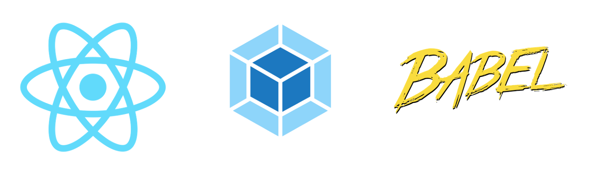

# React Starter App - Using Webpack and Babel
### Usage: A good starting point for a React app with Webpack and Babel.

This is the starting point for a basic React app with Webpack and Babel. It allows you to quickly fire up a single webpage, add your own custom components and see them update realtime in the browser.

To start the server, first run 
>` > npm install` 

followed by 

>` > npm run build`.

This will install all dependencies and build the project creating a new folder `dist` with an **_index.html_** file and **_bundle.js_** file.

The last step to start the server is to run 
>` > npm run start`. 

This will open the application in your browser at [localhost:8080](http://localhost:8080/)

To add components, create a **_.js_** file and add it to the components folder. Import the component into **_App.js_**. If you have any assets, place those in the assets folder.

